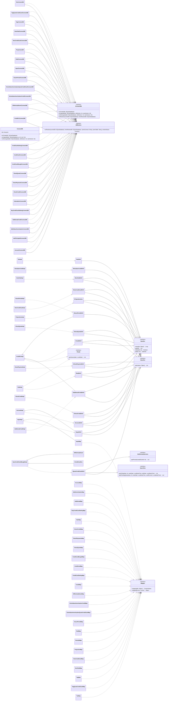

```mermaid
classDiagram
    direction LR

    class IConnectDB {
        <<interface>>
        +onCreate(db: SQLiteDatabase)
        +onUpgrade(db: SQLiteDatabase, oldVersion: Int, newVersion: Int)
        +onDowngrade(db: SQLiteDatabase, oldVersion: Int, newVersion: Int)
        +onRestore(currentDB: SQLiteDatabase, fromRestoreDB: SQLiteDatabase)
    }

    class DBRestore {
        <<abstract>>
        +onRestore(currentDB: SQLiteDatabase, fromRestoreDB: SQLiteDatabase, nameConnect: String, nameTable: String, contentValues: Function)
    }

    class ConnectDB {
        +list: ArrayList
        +onCreate(p0: SQLiteDatabase)
        +onUpgrade(p0: SQLiteDatabase, p1: Int, p2: Int)
        +onDowngrade(db: SQLiteDatabase, oldVersion: Int, newVersion: Int)
    }

    ConnectDB o-- IConnectDB

    class AccountConnectDB
    class AddToCapitalConnectDB
    class AddValueAmortizationConnectDB
    class AdditionalCreditConnectDB
    class BuyCreditCardSettingConnectDB
    class CalculationConnectDB
    class CheckCreditConnectDB
    class CheckPaymentConnectDB
    class CheckQuoteConnectDB
    class CreditCardBoughtConnectDB
    class CreditCardConnectDB
    class CreditCardSettingConnectDB
    class CreditFixConnectDB
    class DifferInstallmentConnectDB
    class ExtraValueAmortizationCreditConnectDB
    class ExtraValueAmortizationQuoteCreditCardConnectDB
    class GracePeriodConnectDB
    class InputConnectDB
    class PaidConnectDB
    class ProjectionsDB
    class SmsCreditCardConnectDB
    class SmsPaidConnectDB
    class TagConnectDB
    class TagQuoteCreditCardConnectDB
    class TaxConnectDB

    AccountConnectDB --|> DBRestore
    AccountConnectDB ..|> IConnectDB
    AddToCapitalConnectDB --|> DBRestore
    AddToCapitalConnectDB ..|> IConnectDB
    AddValueAmortizationConnectDB --|> DBRestore
    AddValueAmortizationConnectDB ..|> IConnectDB
    AdditionalCreditConnectDB --|> DBRestore
    AdditionalCreditConnectDB ..|> IConnectDB
    BuyCreditCardSettingConnectDB --|> DBRestore
    BuyCreditCardSettingConnectDB ..|> IConnectDB
    CalculationConnectDB --|> DBRestore
    CalculationConnectDB ..|> IConnectDB
    CheckCreditConnectDB --|> DBRestore
    CheckCreditConnectDB ..|> IConnectDB
    CheckPaymentConnectDB --|> DBRestore
    CheckPaymentConnectDB ..|> IConnectDB
    CheckQuoteConnectDB --|> DBRestore
    CheckQuoteConnectDB ..|> IConnectDB
    CreditCardBoughtConnectDB --|> DBRestore
    CreditCardBoughtConnectDB ..|> IConnectDB
    CreditCardConnectDB --|> DBRestore
    CreditCardConnectDB ..|> IConnectDB
    CreditCardSettingConnectDB --|> DBRestore
    CreditCardSettingConnectDB ..|> IConnectDB
    CreditFixConnectDB --|> DBRestore
    CreditFixConnectDB ..|> IConnectDB
    DifferInstallmentConnectDB --|> DBRestore
    DifferInstallmentConnectDB ..|> IConnectDB
    ExtraValueAmortizationCreditConnectDB --|> DBRestore
    ExtraValueAmortizationCreditConnectDB ..|> IConnectDB
    ExtraValueAmortizationQuoteCreditCardConnectDB --|> DBRestore
    ExtraValueAmortizationQuoteCreditCardConnectDB ..|> IConnectDB
    GracePeriodConnectDB --|> DBRestore
    GracePeriodConnectDB ..|> IConnectDB
    InputConnectDB --|> DBRestore
    InputConnectDB ..|> IConnectDB
    PaidConnectDB --|> DBRestore
    PaidConnectDB ..|> IConnectDB
    ProjectionsDB --|> DBRestore
    ProjectionsDB ..|> IConnectDB
    SmsCreditCardConnectDB --|> DBRestore
    SmsCreditCardConnectDB ..|> IConnectDB
    SmsPaidConnectDB --|> DBRestore
    SmsPaidConnectDB ..|> IConnectDB
    TagConnectDB --|> DBRestore
    TagConnectDB ..|> IConnectDB
    TagQuoteCreditCardConnectDB --|> DBRestore
    TagQuoteCreditCardConnectDB ..|> IConnectDB
    TaxConnectDB --|> DBRestore
    TaxConnectDB ..|> IConnectDB

    class SaveSvc {
        <<interface>>
        +save(dto: Object): Long
        +getAll(): List
        +delete(id: Int): Boolean
        +get(id: Int): Optional
    }

    class ISaveSvc {
        <<interface>>
        +get(values: Object): List
    }

    class IAccountDAO
    IAccountDAO --|> SaveSvc
    IAccountDAO --|> ISaveSvc

    class IAdditionalCreditDAO
    IAdditionalCreditDAO --|> SaveSvc
    IAdditionalCreditDAO --|> ISaveSvc

    class ICheckCreditDAO
    ICheckCreditDAO --|> SaveSvc
    ICheckCreditDAO --|> ISaveSvc

    class ICheckPaymentDAO
    ICheckPaymentDAO --|> SaveSvc
    ICheckPaymentDAO --|> ISaveSvc

    class ICheckQuoteDAO
    ICheckQuoteDAO --|> SaveSvc
    ICheckQuoteDAO --|> ISaveSvc

    class ICreditDAO
    ICreditDAO --|> SaveSvc
    ICreditDAO --|> ISaveSvc

    class IGracePeriodDAO
    IGracePeriodDAO --|> SaveSvc

    class IInputDAO
    IInputDAO --|> SaveSvc
    IInputDAO --|> ISaveSvc

    class IPaidDAO
    IPaidDAO --|> SaveSvc
    IPaidDAO --|> ISaveSvc

    class IProjectionsSvc
    IProjectionsSvc --|> SaveSvc
    IProjectionsSvc --|> ISaveSvc

    class SearchSvc {
        <<interface>>
        +getToDate(key: Int, startDate: LocalDateTime, endDate: LocalDateTime): List
        +getPendingQuotes(key: Int, startDate: LocalDateTime, cutoffCurrent: LocalDateTime): List
    }

    class IGetPeriodsServices {
        <<interface>>
        +getPeriods(creaditCardId: Int): List
    }

    class IQuoteCreditCardDAO
    IQuoteCreditCardDAO --|> SaveSvc
    IQuoteCreditCardDAO --|> SearchSvc
    IQuoteCreditCardDAO --|> IGetPeriodsServices

    class ISimulatorCreditDAO
    ISimulatorCreditDAO --|> SaveSvc

    class ISmsCreditCardDAO
    ISmsCreditCardDAO --|> SaveSvc
    ISmsCreditCardDAO --|> ISaveSvc

    class ISmsPaidDAO
    ISmsPaidDAO --|> SaveSvc
    ISmsPaidDAO --|> ISaveSvc

    class ITaxDAO
    ITaxDAO --|> SaveSvc

    class AccountImpl
    AccountImpl ..|> IAccountDAO
    AccountImpl o-- IInputDAO

    class AdditionalCreditImpl
    AdditionalCreditImpl ..|> IAdditionalCreditDAO

    class CheckCreditImpl
    CheckCreditImpl ..|> ICheckCreditDAO

    class CheckPaymentImpl
    CheckPaymentImpl ..|> ICheckPaymentDAO

    class CheckQuoteImpl
    CheckQuoteImpl ..|> ICheckQuoteDAO

    class IGraph {
        <<interface>>
        +getValues(date: LocalDate): List
    }

    class CreditFixImpl
    CreditFixImpl ..|> ICreditDAO
    CreditFixImpl ..|> IGraph
    CreditFixImpl o-- IAdditionalCreditDAO
    CreditFixImpl o-- IGracePeriodDAO

    class GracePeriodImpl
    GracePeriodImpl ..|> IGracePeriodDAO

    class InputImpl
    InputImpl ..|> IInputDAO
    InputImpl o-- InputMap

    class PaidImpl
    PaidImpl ..|> IPaidDAO
    PaidImpl ..|> IGraph

    class ProjectionsImpl
    ProjectionsImpl ..|> IProjectionsSvc

    class SaveCreditCardBoughtImpl
    SaveCreditCardBoughtImpl ..|> IQuoteCreditCardDAO
    SaveCreditCardBoughtImpl o-- ICreditCardSvc
    SaveCreditCardBoughtImpl o-- IDifferInstallment

    class SimulatorCreditImpl
    SimulatorCreditImpl ..|> ISimulatorCreditDAO

    class SmsCreditCardImpl
    SmsCreditCardImpl ..|> ISmsCreditCardDAO

    class SmsPaidImpl
    SmsPaidImpl ..|> ISmsPaidDAO

    class TaxImpl
    TaxImpl ..|> ITaxDAO

    class IMapper {
        <<interface>>
        +mapping(dto: Object): ContentValues
        +mapping(cursor: Cursor): Object
    }

    class AccountMap
    AccountMap ..|> IMapper

    class AddAmortizationMap
    AddAmortizationMap ..|> IMapper

    class AdditionalMap
    AdditionalMap ..|> IMapper

    class BuyCreditCardSettingMap
    BuyCreditCardSettingMap ..|> IMapper

    class CalcMap
    CalcMap ..|> IMapper

    class CheckCreditMap
    CheckCreditMap ..|> IMapper

    class CheckPaymentsMap
    CheckPaymentsMap ..|> IMapper

    class CheckQuoteMap
    CheckQuoteMap ..|> IMapper

    class CreditCardBoughtMap
    CreditCardBoughtMap ..|> IMapper

    class CreditCardMap
    CreditCardMap ..|> IMapper

    class CreditCardSettingMap
    CreditCardSettingMap ..|> IMapper

    class CreditMap
    CreditMap ..|> IMapper

    class DifferInstallmentMap
    DifferInstallmentMap ..|> IMapper

    class ExtraValueAmortizationCreditMap
    ExtraValueAmortizationCreditMap ..|> IMapper

    class ExtraValueAmortizationQuoteCreditCardMap
    ExtraValueAmortizationQuoteCreditCardMap ..|> IMapper

    class GracePeriodMap
    GracePeriodMap ..|> IMapper

    class InputMap
    InputMap ..|> IMapper

    class PaidMap
    PaidMap ..|> IMapper

    class PeriodsMap
    PeriodsMap ..|> IMapper

    class ProjectionMap
    ProjectionMap ..|> IMapper

    class SmsCreditCardMap
    SmsCreditCardMap ..|> IMapper

    class SmsPaidMap
    SmsPaidMap ..|> IMapper

    class TagMap
    TagMap ..|> IMapper

    class TagQuoteCreditCardMap
    TagQuoteCreditCardMap ..|> IMapper

    class TaxMap
    TaxMap ..|> IMapper

```
