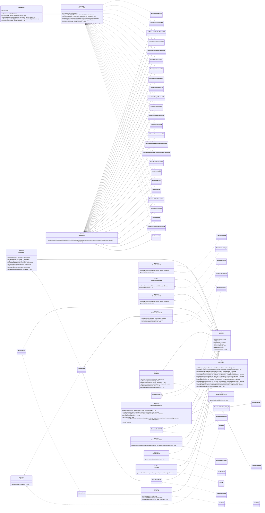

```mermaid
classDiagram
    direction LR

    class IConnectDB {
        <<interface>>
        +onCreate(db: SQLiteDatabase)
        +onUpgrade(db: SQLiteDatabase, oldVersion: Int, newVersion: Int)
        +onDowngrade(db: SQLiteDatabase, oldVersion: Int, newVersion: Int)
        +onRestore(currentDB: SQLiteDatabase, fromRestoreDB: SQLiteDatabase)
        +update(oldVersion: Int, newVersion: Int, sqlAlter: Map, fn: Function)
        +onStats(connectionDB: SQLiteDatabase): Pair
    }

    class DBRestore {
        <<abstract>>
        +onRestore(currentDB: SQLiteDatabase, fromRestoreDB: SQLiteDatabase, nameConnect: String, nameTable: String, contentValues: Function)
    }

    class ConnectDB {
        +list: ArrayList
        +onCreate(p0: SQLiteDatabase)
        +onUpgrade(p0: SQLiteDatabase, p1: Int, p2: Int)
        +onDowngrade(db: SQLiteDatabase, oldVersion: Int, newVersion: Int)
        +onRestore(currentDB: SQLiteDatabase, fromRestoreDB: SQLiteDatabase)
        +onStats(connectionDB: SQLiteDatabase): List
    }

    ConnectDB o-- IConnectDB

    class AccountConnectDB
    class AddToCapitalConnectDB
    class AddValueAmortizationConnectDB
    class AdditionalCreditConnectDB
    class BuyCreditCardSettingConnectDB
    class CalculationConnectDB
    class CheckCreditConnectDB
    class CheckPaymentConnectDB
    class CheckQuoteConnectDB
    class CreditCardBoughtConnectDB
    class CreditCardConnectDB
    class CreditCardSettingConnectDB
    class CreditFixConnectDB
    class DifferInstallmentConnectDB
    class ExtraValueAmortizationCreditConnectDB
    class ExtraValueAmortizationQuoteCreditCardConnectDB
    class GracePeriodConnectDB
    class InputConnectDB
    class PaidConnectDB
    class ProjectionsDB
    class SmsCreditCardConnectDB
    class SmsPaidConnectDB
    class TagConnectDB
    class TagQuoteCreditCardConnectDB
    class TaxConnectDB

    DBRestore <|-- AccountConnectDB
    IConnectDB <|.. AccountConnectDB
    DBRestore <|-- AddToCapitalConnectDB
    IConnectDB <|.. AddToCapitalConnectDB
    DBRestore <|-- AddValueAmortizationConnectDB
    IConnectDB <|.. AddValueAmortizationConnectDB
    DBRestore <|-- AdditionalCreditConnectDB
    IConnectDB <|.. AdditionalCreditConnectDB
    DBRestore <|-- BuyCreditCardSettingConnectDB
    IConnectDB <|.. BuyCreditCardSettingConnectDB
    DBRestore <|-- CalculationConnectDB
    IConnectDB <|.. CalculationConnectDB
    DBRestore <|-- CheckCreditConnectDB
    IConnectDB <|.. CheckCreditConnectDB
    DBRestore <|-- CheckPaymentConnectDB
    IConnectDB <|.. CheckPaymentConnectDB
    DBRestore <|-- CheckQuoteConnectDB
    IConnectDB <|.. CheckQuoteConnectDB
    DBRestore <|-- CreditCardBoughtConnectDB
    IConnectDB <|.. CreditCardBoughtConnectDB
    DBRestore <|-- CreditCardConnectDB
    IConnectDB <|.. CreditCardConnectDB
    DBRestore <|-- CreditCardSettingConnectDB
    IConnectDB <|.. CreditCardSettingConnectDB
    DBRestore <|-- CreditFixConnectDB
    IConnectDB <|.. CreditFixConnectDB
    DBRestore <|-- DifferInstallmentConnectDB
    IConnectDB <|.. DifferInstallmentConnectDB
    DBRestore <|-- ExtraValueAmortizationCreditConnectDB
    IConnectDB <|.. ExtraValueAmortizationCreditConnectDB
    DBRestore <|-- ExtraValueAmortizationQuoteCreditCardConnectDB
    IConnectDB <|.. ExtraValueAmortizationQuoteCreditCardConnectDB
    DBRestore <|-- GracePeriodConnectDB
    IConnectDB <|.. GracePeriodConnectDB
    DBRestore <|-- InputConnectDB
    IConnectDB <|.. InputConnectDB
    DBRestore <|-- PaidConnectDB
    IConnectDB <|.. PaidConnectDB
    DBRestore <|-- ProjectionsDB
    IConnectDB <|.. ProjectionsDB
    DBRestore <|-- SmsCreditCardConnectDB
    IConnectDB <|.. SmsCreditCardConnectDB
    DBRestore <|-- SmsPaidConnectDB
    IConnectDB <|.. SmsPaidConnectDB
    DBRestore <|-- TagConnectDB
    IConnectDB <|.. TagConnectDB
    DBRestore <|-- TagQuoteCreditCardConnectDB
    IConnectDB <|.. TagQuoteCreditCardConnectDB
    DBRestore <|-- TaxConnectDB
    IConnectDB <|.. TaxConnectDB

    class SaveSvc {
        <<interface>>
        +save(dto: Object): Long
        +getAll(): List
        +delete(id: Int): Boolean
        +get(id: Int): Optional
        +get(values: Object): List
        +backup(path: String)
        +restoreBackup(path: String)
    }

    class IAccountDAO
    IAccountDAO --|> SaveSvc

    class IAdditionalCreditDAO {
        <<interface>>
        +updateValue(id: Int, value: BigDecimal): Boolean
        +get(codeCredit: Int, date: LocalDate): List
        +update(dto: AdditionalCreditDTO): Int
    }
    IAdditionalCreditDAO --|> SaveSvc

    class ICheckCreditDAO {
        <<interface>>
        +getCheckPayment(codPaid: Int, period: String): Optional
        +getPeriodsPayment(): List
    }
    ICheckCreditDAO --|> SaveSvc

    class ICheckPaymentDAO {
        <<interface>>
        +getCheckPayment(codPaid: Int, period: String): Optional
        +getPeriodsPayment(): List
    }
    ICheckPaymentDAO --|> SaveSvc

    class ICheckQuoteDAO {
        <<interface>>
        +getCheckPayment(codPaid: Int, period: String): Optional
        +getPeriodsPayment(): List
    }
    ICheckQuoteDAO --|> SaveSvc

    class ICreditDAO {
        <<interface>>
        +getInterestAll(date: LocalDate): BigDecimal
        +getCapitalAll(date: LocalDate): BigDecimal
        +getQuoteAll(date: LocalDate): BigDecimal
        +getPendingToPayAll(date: LocalDate): BigDecimal
        +getAdditionalAll(date: LocalDate): BigDecimal
        +getPeriods(): List
        +getTotalQuote(date: LocalDate): BigDecimal
        +getCurrentBoughtCredits(date: LocalDate): List
    }
    ICreditDAO --|> SaveSvc

    class IGracePeriodDAO
    IGracePeriodDAO --|> SaveSvc

    class IInputDAO {
        <<interface>>
        +getTotalInputs(): BigDecimal
        +getTotalInputsSemestral(): BigDecimal
        +getAllValid(accountCode: Int, date: LocalDate): List
    }
    IInputDAO --|> SaveSvc

    class IPaidDAO {
        <<interface>>
        +getTotalPaid(current: LocalDate): BigDecimal
        +getRecurrent(date: LocalDate): List
        +getAll(codeAccount: Int, period: YearMonth): List
        +getRecurrents(codeAccount: Int, period: YearMonth): List
        +getPeriods(codeAccount: Long): List
        +findByNameValueDate(values: PaidDTO): List
    }
    IPaidDAO --|> SaveSvc

    class IProjectionsSvc
    IProjectionsSvc --|> SaveSvc

    class SearchSvc {
        <<interface>>
        +getToDate(key: Int, startDate: LocalDateTime, endDate: LocalDateTime): List
        +getPendingQuotes(key: Int, startDate: LocalDateTime, cutoffCurrent: LocalDateTime): List
        +getCapital(key: Int, startDate: LocalDateTime, cutOff: LocalDateTime): Optional
        +getInterest(key: Int, startDate: LocalDateTime, cutOff: LocalDateTime): Optional
        +getCapitalPendingQuotes(key: Int, startDate: LocalDateTime, cutOff: LocalDateTime): Optional
        +getInterestPendingQuotes(key: Int, startDate: LocalDateTime, cutOff: LocalDateTime): Optional
        +getBought(key: Int, startDate: LocalDateTime, cutOff: LocalDateTime): Optional
        +getBoughtQuotes(key: Int, startDate: LocalDateTime, cutOff: LocalDateTime): Optional
        +getBoughtPendingQuotes(key: Int, startDate: LocalDateTime, cutOff: LocalDateTime): Optional
        +getPendingToPay(key: Int, startDate: LocalDateTime, cutOff: LocalDateTime): Optional
        +getPendingToPayQuotes(key: Int, startDate: LocalDateTime, cutOff: LocalDateTime): Optional
        +getRecurrentBuys(key: Int, cutOff: LocalDateTime): List
    }

    class IGetPeriodsServices {
        <<interface>>
        +getPeriods(creaditCardId: Int): List
    }

    class IQuoteCreditCardDAO {
        <<interface>>
        +getRecurrentPendingQuotes(key: Int, cutOff: LocalDateTime): List
        +endingRecurrentPayment(idBought: Int, cutOff: LocalDateTime): Boolean
        +endingPayment(idBought: Int, message: String, cutOff: LocalDateTime): Boolean
        +getLastAvailableQuotesTC(): List
        +getPeriod(id: Int): List
        +findByNameAndBoughtDateAndValue(name: String, boughtDate: LocalDateTime, amount: BigDecimal): CreditCardBoughtDTO
        +fixDataProcess()
    }
    IQuoteCreditCardDAO --|> SaveSvc
    IQuoteCreditCardDAO --|> SearchSvc
    IQuoteCreditCardDAO --|> IGetPeriodsServices

    class ISimulatorCreditDAO
    ISimulatorCreditDAO --|> SaveSvc

    class ISmsCreditCardDAO {
        <<interface>>
        +getByCreditCardAndKindInterest(codeCreditCard: Int, kind: KindInterestRateEnum): List
    }
    ISmsCreditCardDAO --|> SaveSvc

    class ISmsPaidDAO {
        <<interface>>
        +getByAccount(codeAccount: Int): List
    }
    ISmsPaidDAO --|> SaveSvc

    class ITaxDAO {
        <<interface>>
        +get(codCreditCard: Long, month: Int, year: Int, kind: TaxEnum): Optional
    }
    ITaxDAO --|> SaveSvc

    class AccountImpl
    IAccountDAO <|.. AccountImpl
    AccountImpl o-- IInputDAO

    class AdditionalCreditImpl
    IAdditionalCreditDAO <|.. AdditionalCreditImpl

    class CheckCreditImpl
    ICheckCreditDAO <|.. CheckCreditImpl

    class CheckPaymentImpl
    ICheckPaymentDAO <|.. CheckPaymentImpl

    class CheckQuoteImpl
    ICheckQuoteDAO <|.. CheckQuoteImpl

    class IGraph {
        <<interface>>
        +getValues(date: LocalDate): List
    }

    class CreditFixImpl
    ICreditDAO <|.. CreditFixImpl
    IGraph <|.. CreditFixImpl
    CreditFixImpl o-- IAdditionalCreditDAO
    CreditFixImpl o-- IGracePeriodDAO

    class GracePeriodImpl
    IGracePeriodDAO <|.. GracePeriodImpl

    class InputImpl
    IInputDAO <|.. InputImpl
    InputImpl o-- InputMap

    class PaidImpl
    IPaidDAO <|.. PaidImpl
    IGraph <|.. PaidImpl

    class ProjectionsImpl
    IProjectionsSvc <|.. ProjectionsImpl

    class SaveCreditCardBoughtImpl
    IQuoteCreditCardDAO <|.. SaveCreditCardBoughtImpl
    SaveCreditCardBoughtImpl o-- ICreditCardSvc
    SaveCreditCardBoughtImpl o-- IDifferInstallment

    class SimulatorCreditImpl
    ISimulatorCreditDAO <|.. SimulatorCreditImpl

    class SmsCreditCardImpl
    ISmsCreditCardDAO <|.. SmsCreditCardImpl

    class SmsPaidImpl
    ISmsPaidDAO <|.. SmsPaidImpl

    class TaxImpl
    ITaxDAO <|.. TaxImpl

```
